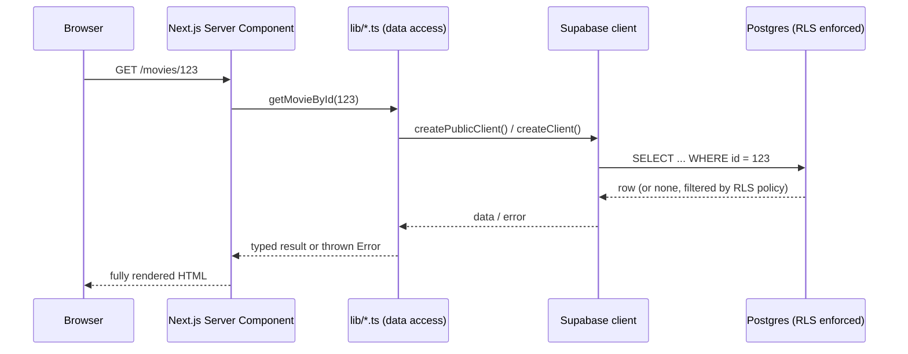
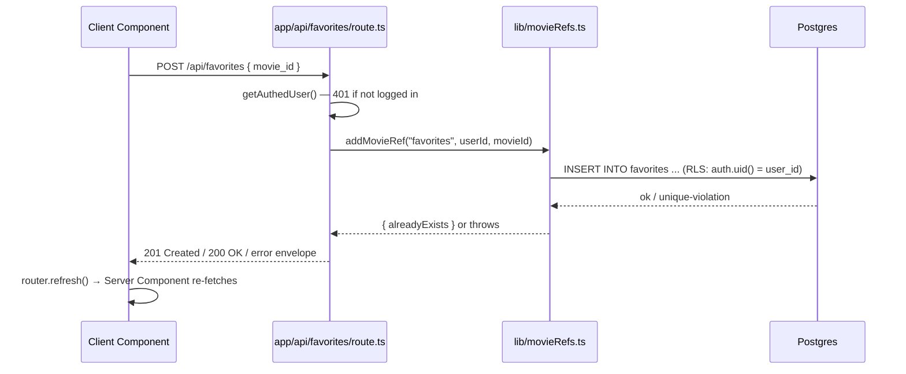
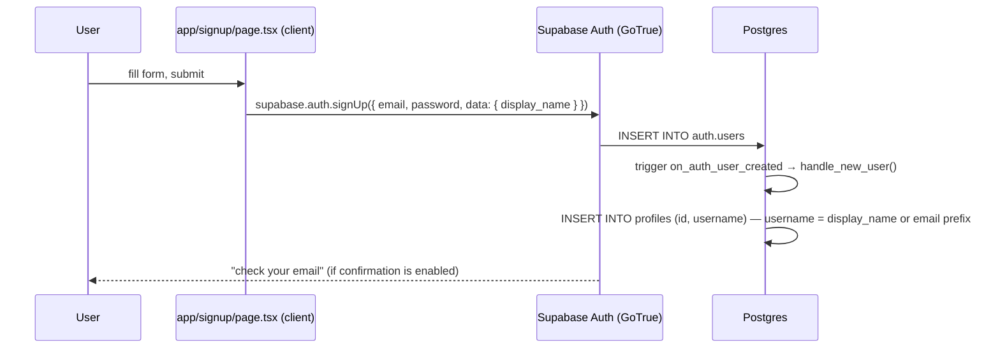
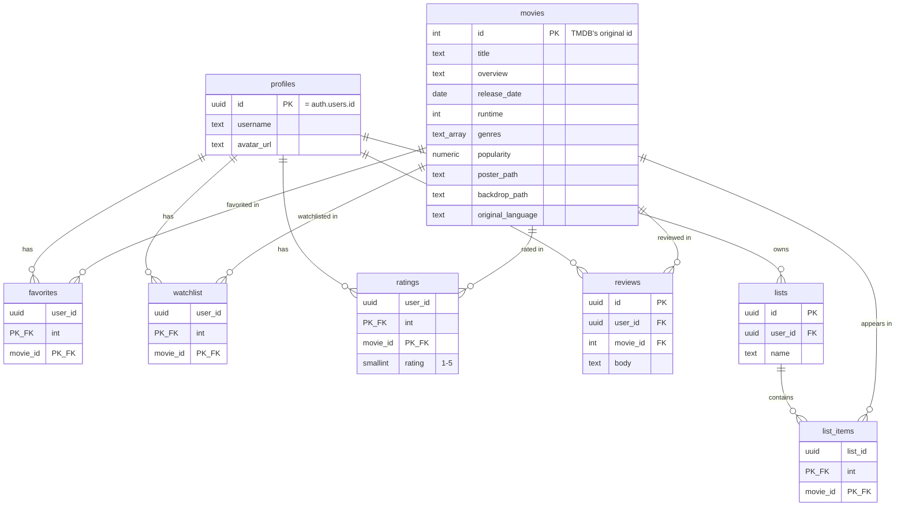
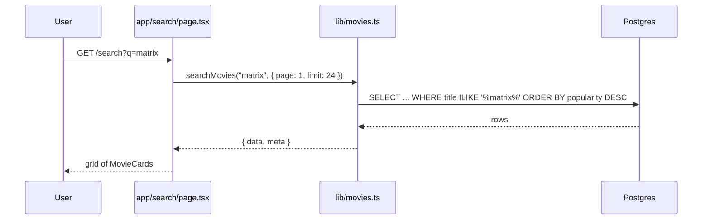
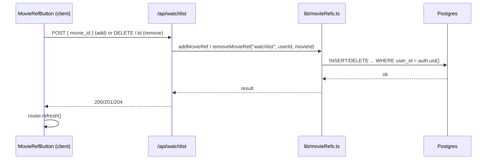

# ScreenCrave — Backend Learning Guide

This is a learning project built to understand **Next.js (App Router)**, **Supabase** (Postgres + Auth + Row Level Security), and how a modern full-stack app is put together end to end. It is intentionally small: every file has exactly one job, and every feature can be traced UI → API → Database → Response in a couple of hops. This document is the single source of truth for explaining the project — read it top to bottom once, then use the Table of Contents to jump back to any feature.

## Table of Contents

1. [What This Project Is](#1-what-this-project-is)
2. [Folder Structure](#2-folder-structure)
3. [The Request Lifecycle](#3-the-request-lifecycle)
4. [Server Components vs Client Components](#4-server-components-vs-client-components)
5. [Supabase Integration](#5-supabase-integration)
6. [Authentication Flow](#6-authentication-flow)
7. [Database Design](#7-database-design)
8. [The API Layer](#8-the-api-layer)
9. [Feature Flows](#9-feature-flows)
10. [Styling System](#10-styling-system)
11. [Running the Project](#11-running-the-project)
12. [Design Decisions Worth Explaining to Your Mentor](#12-design-decisions-worth-explaining-to-your-mentor)

---

## 1. What This Project Is

ScreenCrave is a movie tracking app: search a local movie dataset, view a movie's details, and keep personal favorites, a watchlist, custom lists, star ratings, and written reviews — all scoped to your own Supabase-authenticated account.

**It does not call the TMDB API at runtime.** A one-time import script (`scripts/import-movies.mjs`) loaded a filtered CSV dataset (`dataset/TMDB_movie_dataset_v11.csv`) into ScreenCrave's own `movies` table once. From that point on, every read (search, movie details) queries **ScreenCrave's own Postgres database**, not TMDB. The only remaining TMDB dependency is cosmetic: poster/backdrop **images** are loaded directly from TMDB's image CDN (`image.tmdb.org`) by URL, because re-hosting hundreds of thousands of images ourselves would be its own project.

This matters pedagogically: it means every data-fetching function in this app is a **real backend read/write against a real schema you own**, not a proxy to someone else's API.

## 2. Folder Structure

```
frontend/
├── src/
│   ├── app/                        # Next.js App Router — one folder per route
│   │   ├── layout.tsx              # Root HTML shell, imports all global CSS, renders NavBar
│   │   ├── page.tsx                # "/" — personalized dashboard (Watchlist)
│   │   ├── search/page.tsx         # "/search" — movie search
│   │   ├── movies/[id]/page.tsx    # "/movies/123" — Movie Details
│   │   ├── favourites/page.tsx     # "/favourites" — your Favorites grid
│   │   ├── lists/page.tsx          # "/lists" — your custom Lists
│   │   ├── lists/[id]/page.tsx     # "/lists/abc" — one list's movies
│   │   ├── login/page.tsx          # "/login" — sign-in form (Client Component)
│   │   ├── signup/page.tsx         # "/signup" — registration form (Client Component)
│   │   ├── loading.tsx             # Route-level loading fallback (Suspense boundary)
│   │   ├── error.tsx               # Route-level error boundary
│   │   └── api/                    # Route Handlers — the app's HTTP API
│   │       ├── favorites/, watchlist/, lists/, ratings/, reviews/
│   │       ├── movies/[id]/, movies/[id]/reviews/
│   │       └── search/
│   │
│   ├── lib/                        # The actual backend: data access + validation, server-only
│   │   ├── supabase/
│   │   │   ├── server.ts           # Cookie-bound client — Server Components, Route Handlers
│   │   │   ├── client.ts           # Browser client — Client Components (auth calls only)
│   │   │   └── public.ts           # Stateless client — cacheable public reads (movies)
│   │   ├── api.ts                  # Shared response envelope + auth helper for Route Handlers
│   │   ├── movies.ts                # getMovieById, searchMovies (+ Zod schemas)
│   │   ├── movieRefs.ts             # Shared favorites/watchlist logic (identical table shape)
│   │   ├── lists.ts                 # Custom lists CRUD + list-items CRUD
│   │   ├── ratings.ts                # Star ratings (upsert)
│   │   └── reviews.ts                # Written reviews CRUD
│   │
│   ├── components/                 # Reusable UI. Presentational unless noted "use client"
│   │   ├── NavBar.tsx / NavBarSkeleton.tsx / navLinks.ts
│   │   ├── MovieCard.tsx           # Poster + title + year + link — no state, no client JS
│   │   ├── CreateListForm.tsx      # Client island: create a list
│   │   ├── DeleteListButton.tsx    # Client island: delete a list
│   │   ├── RemoveFromListButton.tsx# Client island: remove a movie from a list
│   │   └── movie-detail/           # Movie Details page sections
│   │       ├── Hero.tsx            # Poster, title, year/runtime, action buttons
│   │       ├── MovieInfo.tsx       # Overview, release date, runtime, language, genres
│   │       ├── CommunityRating.tsx # Client island: star rating widget
│   │       ├── CommunityReviews.tsx# Client island: write/edit/delete your review
│   │       ├── MovieRefButton.tsx  # Client island: favorite / watchlist toggle (reused everywhere)
│   │       └── AddToListButton.tsx # Client island: add movie to one of your lists
│   │
│   ├── css/                        # Design tokens + shared primitives (App.css), one file per feature
│   ├── types.ts                    # Shared `Movie` shape used by UI components
│   ├── proxy.ts                    # Next.js Middleware — refreshes the Supabase session cookie
│   └── instrumentation.ts          # Node startup hook (IPv4-first DNS — see note in file)
│
├── supabase/migrations/            # The database's source of truth, applied in order
├── scripts/
│   ├── import-movies.mjs           # One-off: CSV → `movies` table (already run; safe to re-run)
│   └── run-sql.mjs                 # One-off: apply a migration file to DATABASE_URL
├── dataset/                        # The source CSV (not imported into the app bundle)
└── api-tests/                      # Bruno collection — manual/scripted API testing, not part of the app
```

**Why no `contexts/` or `views/` folder.** An earlier version of this app used React Context (`MovieContext`, `ListContext`) to share favorites/list state across pages, with a `views/` folder holding page content separately from `app/**/page.tsx`. Both were removed in the simplification pass:

- **Context was solving a problem that didn't need solving.** Every page that needs "is this movie in my favorites?" already knows the answer at request time — it's a Server Component, so it just queries Supabase directly and passes the answer down as a prop (`initialActive={true/false}`). The single reusable `MovieRefButton` client island (originally built only for the Movie Details page) turned out to be a complete, simpler replacement for the Context-based toggle logic everywhere else too.
- **The `page.tsx` → `views/X.tsx` split added a hop with no payoff** once every page collapsed to "fetch on the server, render a grid." Each route is now one file: a Server Component that fetches its own data and returns JSX directly (the standard App Router pattern). Client-only pages (`login`, `signup`) simply put `"use client"` at the top of their own `page.tsx` instead of importing a separate client view.

## 3. The Request Lifecycle

Every page in this app follows the same shape:



For a **mutation** (favoriting a movie, posting a review), the browser instead calls one of the app's own `/api/*` Route Handlers, which follows the same lib → Supabase → Postgres chain, then the client component calls `router.refresh()` so the Server Component re-fetches fresh data:



Every Route Handler in this app follows this exact shape: **authenticate → validate with Zod → call one `lib/*.ts` function → return a consistent JSON envelope**. See `lib/api.ts`'s `ok`/`created`/`noContent`/`fail`/`validationError`/`handleDataError` helpers — every route uses the same handful of response shapes, so once you've read one route handler, you've effectively read all of them.

## 4. Server Components vs Client Components

**Default to Server.** Every page in `src/app/` is a Server Component unless it has a `"use client"` directive at the top. Server Components can call `lib/*.ts` functions directly (no network round-trip, no API route needed) because they run on the server, next to the database.

| File | Kind | Why |
|---|---|---|
| `app/page.tsx`, `app/search/page.tsx`, `app/favourites/page.tsx`, `app/lists/page.tsx`, `app/lists/[id]/page.tsx`, `app/movies/[id]/page.tsx` | Server | Pure data-fetch-then-render; no interactivity of their own |
| `app/login/page.tsx`, `app/signup/page.tsx` | Client | The entire page is a controlled form — state (`email`, `password`, `loading`) lives in the browser |
| `MovieCard.tsx`, `Hero.tsx`, `MovieInfo.tsx` | Server (no directive) | Pure presentation — poster, text, links. No `useState`, no event handlers |
| `MovieRefButton.tsx`, `AddToListButton.tsx`, `CommunityRating.tsx`, `CommunityReviews.tsx`, `CreateListForm.tsx`, `DeleteListButton.tsx`, `RemoveFromListButton.tsx` | Client ("use client") | Each needs `onClick`/`onSubmit`, local state, or `useRouter()` |
| `NavBar.tsx` | Client | Reads the live Supabase auth session, which can change without a page reload |

**The minimization principle:** `"use client"` marks the *boundary* — everything below that import in the component tree ships JS to the browser. So Movie Details is a Server Component page that renders mostly static server-rendered HTML (`Hero`, `MovieInfo`), with small, isolated client "islands" dropped in only where a click actually needs to happen (`MovieRefButton`, `AddToListButton`, `CommunityRating`, `CommunityReviews`). This is why the Movie Details page never needed a client-side data-fetch: `getMovieById`, `getReviewsForMovie`, `getUserRating`, `hasMovieRef`, and `listLists` are all called directly, in parallel (`Promise.all`), inside the Server Component.

## 5. Supabase Integration

There are **three** ways this app talks to Supabase, each solving a different problem:

| Client | File | Used from | Knows who's logged in? | Why it exists |
|---|---|---|---|---|
| Server client | `lib/supabase/server.ts` | Server Components, Route Handlers | Yes — reads the session from cookies | The default for anything that needs `auth.uid()` (RLS-protected reads/writes) |
| Browser client | `lib/supabase/client.ts` | Client Components | Yes — reads the session from the browser's cookies | Only used for **auth itself** (`signIn`, `signUp`, `signOut`, `onAuthStateChange`) — never for data, since every data operation instead goes through this app's own `/api/*` routes |
| Public (stateless) client | `lib/supabase/public.ts` | `lib/movies.ts` only | No — no cookies, always anonymous | Next.js's Cache Components (`"use cache"`) forbid reading cookies inside a cached function. `getMovieById` is cached (`cacheLife("minutes")`), and movies/ratings are publicly readable (`select using (true)` RLS), so it doesn't need a session anyway |

**How cookies work here.** Supabase Auth issues a JWT session stored in cookies (`sb-<project>-auth-token`, etc.). `lib/supabase/server.ts` hands the cookie jar to `createServerClient`, which reads the JWT on every request to answer `auth.getUser()`. `proxy.ts` (Next's Middleware, matched against nearly every route) calls `supabase.auth.getUser()` on each request purely to trigger a **token refresh** if the access token has expired — without it, a session would silently die after the access token's short TTL even though the refresh token is still valid.

**How RLS still works no matter which client is used.** Row Level Security policies are evaluated by Postgres itself, based on the JWT's `auth.uid()` claim — not by application code. Whether the query came from the server client, the browser client, or a Route Handler makes no difference to Postgres; it only cares whether a valid JWT was presented and what `auth.uid()` resolves to for that connection. This is why `lib/*.ts` functions can be short: they don't need `WHERE user_id = ?` ownership checks for *every* operation — the database itself refuses reads/writes that don't belong to the caller (see `list_items`' policy in Section 7 for the clearest example).

## 6. Authentication Flow



1. **Register** — `signup/page.tsx` calls `supabase.auth.signUp()` with the browser client, passing `display_name` as user metadata. A Postgres trigger (`on_auth_user_created`, defined in `0001_baseline.sql` and fixed in `0002`) automatically inserts a matching row into `profiles` — the app never writes to `profiles` directly.
2. **Login** — `login/page.tsx` calls `supabase.auth.signInWithPassword()`. On success, Supabase sets the session cookies and the page does `router.push("/") + router.refresh()` so the newly-authenticated Server Components re-render.
3. **Session** — every subsequent request, `proxy.ts` refreshes the token if needed, and `lib/supabase/server.ts` reads the current user from the (possibly refreshed) cookies.
4. **Logout** — `NavBar.tsx` calls `supabase.auth.signOut()`, which clears the session cookies, then redirects home.
5. **Everywhere else in the app reacts to the session automatically**: `NavBar` uses `onAuthStateChange` (fires once immediately with the current session, then again on every login/logout) to know whether to show "Log In / Sign Up" or the user's avatar menu. Every other page just calls `supabase.auth.getUser()` server-side on each request — there's no client-side auth state to keep in sync because there's no client-side data fetching left.

## 7. Database Design

Only the tables this app actually uses remain, after `0006_simplify_schema.sql` dropped the unused `genres` lookup table and 13 unused `movies` columns that were never displayed (TMDB metadata like budget, revenue, production companies, etc.):



**Row Level Security — the exact anatomy of one policy.** Every table has RLS enabled. Two shapes cover the whole app:

- **Fully private** (favorites, watchlist, lists, ratings/reviews writes): `using (auth.uid() = user_id)` — a row is only visible/writable to the user who owns it.
- **Public read, owner write** (movies, ratings/reviews reads): `for select using (true)` — anyone (even anonymous) can read, but insert/update/delete policies still check `auth.uid() = user_id`.

The most interesting policy is on **`list_items`**, because that table has no `user_id` column of its own — ownership is inherited from its parent list:

```sql
create policy "list_items_select_own" on list_items
  for select using (
    exists (select 1 from lists where lists.id = list_items.list_id and lists.user_id = auth.uid())
  );
```

This is why `lib/lists.ts`'s `addListItem`/`removeListItem` don't need to manually check "does this list belong to the caller?" — an insert against someone else's list simply gets rejected by Postgres (surfaced by `lib/api.ts`'s `handleDataError` as a 404, not a 403, so the existence of another user's list isn't leaked).

**Foreign keys**: `favorites`, `watchlist`, `ratings`, `reviews`, and `list_items` all reference `movies(id) on delete cascade` and `profiles(id)`/`lists(id) on delete cascade` — delete a movie or a user and their dependent rows disappear automatically; no application-level cleanup code needed.

**Migrations, in order**: `0001` (baseline schema + RLS), `0002` (swap the TMDB-cache-shaped `movies` table for the CSV-dataset-shaped one), `0003` (add the FK constraints deferred from 0002, once the dataset was imported), `0004`→`0005` (a genre-lookup table added then a dead `recently_viewed` table removed), `0006` (this project's simplification pass: drops the `genres` table, 13 unused `movies` columns, and the two indexes — `movies_genres_gin_idx`, `movies_release_date_idx` — that only ever backed the removed genre-filter/sort-by-date feature; see Section 12).

## 8. The API Layer

Every Route Handler returns one of two JSON shapes (see `lib/api.ts`):

```
success: { "data": ..., "meta"?: { "page", "limit", "total" } }
error:   { "error": { "code", "message", "details"? } }
```

| Method & Path | Auth required | Calls | Purpose |
|---|---|---|---|
| `GET /api/movies/:id` | No | `getMovieById` | One movie's details + community rating |
| `GET /api/search?q=` | No | `searchMovies` | Title search (also used directly, server-side, by `/search`) |
| `GET /api/movies/:id/reviews` | No | `getReviewsForMovie` | Paginated reviews for a movie |
| `GET`/`POST /api/favorites`, `DELETE /api/favorites/:id` | Yes | `lib/movieRefs.ts` | Favorites CRUD |
| `GET`/`POST /api/watchlist`, `DELETE /api/watchlist/:id` | Yes | `lib/movieRefs.ts` | Watchlist CRUD (identical shape to favorites — same shared functions, different table name) |
| `GET`/`POST /api/lists`, `GET`/`PUT`/`DELETE /api/lists/:id` | Yes | `lib/lists.ts` | List CRUD |
| `POST /api/lists/:id/items`, `DELETE /api/lists/:id/items/:movieId` | Yes | `lib/lists.ts` | Add/remove a movie from a list |
| `POST /api/ratings` | Yes | `lib/ratings.ts` | Upsert your 1–5 star rating |
| `POST /api/reviews`, `PUT`/`DELETE /api/reviews/:id` | Yes | `lib/reviews.ts` | Write/edit/delete your review |

`favorites` and `watchlist` share one implementation (`lib/movieRefs.ts`) because they're structurally identical tables (`user_id`, `movie_id`, `created_at`) with identical add/remove/list semantics — the only difference is which table name gets passed in. This is the one deliberate, justified abstraction in the data layer; everything else is one function per one job.

The Bruno collection in `api-tests/` exercises every endpoint above directly over HTTP — useful for testing the API independently of the UI (see `api-tests/README.md`).

## 9. Feature Flows

### Search

`app/search/page.tsx` is a Server Component that reads `?q=` straight from `searchParams` and calls `searchMovies()` from `lib/movies.ts` directly — no client-side fetch, no JavaScript required for the search itself. The search box is a plain HTML `<form action="/search" method="GET">`; submitting it is just a normal browser navigation to `/search?q=...`.



### Movie Details

`app/movies/[id]/page.tsx` fetches everything the page needs in parallel (`Promise.all`): the movie itself, its reviews, the current user's rating, whether it's favorited/watchlisted, and the user's lists (for the "Add to List" dropdown) — then renders `Hero` + `MovieInfo` (server-rendered) with `MovieRefButton` × 2, `AddToListButton`, `CommunityRating`, and `CommunityReviews` as client islands for the interactive parts.

The page is deliberately minimal — it shows exactly these fields and nothing else:

- **`Hero`**: poster, backdrop, title, release year, runtime, and the three action buttons (Favorite / Watchlist / Add to List).
- **`MovieInfo`**: overview ("Story"), release date, runtime, original language, and genres ("Movie Information").
- **`CommunityRating`**: the average of every `ratings` row for this movie, plus your own 1–5 star rating.
- **`CommunityReviews`**: every written review, plus your own write/edit/delete form.

There is intentionally no tagline, status badge, TMDB vote average, budget/revenue, production companies, cast/crew, trailers, similar movies, or recommendations — none of that data serves a real feature in this app, so it isn't fetched or rendered (see Section 12, point 3).

### Favorites & Watchlist

Both features share `lib/movieRefs.ts`. Toggling is the same `MovieRefButton` component in two places:
- **On Movie Details**: `initialActive` reflects whether this one movie is already favorited/watchlisted; clicking POSTs or DELETEs `/api/favorites` or `/api/watchlist`.
- **On the Favorites page / Home dashboard's Watchlist section**: the same button is rendered with `initialActive={true}` on every card, doubling as the "remove from this collection" control.



### Home Dashboard

`app/page.tsx` is the only page that reads the watchlist for display. If logged in, it greets the user with a time-of-day-aware message (`greeting()` checks the server's local hour: "Good Morning" before noon, "Good Afternoon" before 6pm, otherwise "Good Evening") followed by their name (`user.user_metadata.display_name`, falling back to the email prefix — the same derivation `NavBar` uses), then renders `listMovieRefs("watchlist", user.id)` as a `MovieCard` grid, or the empty-state copy ("No movies in your watchlist yet...") if the watchlist is empty. Logged out, it shows a simple login/signup prompt instead. It intentionally does **not** show favorites, a public movie feed, or anything else — movie discovery happens through Search and Movie Details only.

### Lists

`app/lists/page.tsx` fetches `listLists(user.id)` and renders `CreateListForm` (POST `/api/lists`) plus one card per list with `DeleteListButton` (DELETE `/api/lists/:id`). `app/lists/[id]/page.tsx` fetches `getListWithItems(user.id, id)` (a list plus its movies, joined in one query) and renders each movie with `RemoveFromListButton` (DELETE `/api/lists/:id/items/:movieId`). Adding a movie to a list happens from the Movie Details page's `AddToListButton`, which can also create a brand-new list inline.

### Ratings

`CommunityRating` (on Movie Details) is a 5-star widget. Clicking a star POSTs `{ movie_id, rating }` to `/api/ratings`, which calls `upsertRating` — an `INSERT ... ON CONFLICT (user_id, movie_id) DO UPDATE`, so rating a movie twice just overwrites your previous rating instead of erroring. The average shown next to the stars is computed in `getMovieById` itself, by averaging every `ratings` row for that movie (public read policy — anyone can see the aggregate).

### Reviews

`CommunityReviews` (on Movie Details) shows every review for the movie (author + body + date) and, if logged in, a form to write one. `createReview` first checks whether the user already reviewed this movie (also enforced at the DB level by a `unique (user_id, movie_id)` constraint) and returns a conflict rather than erroring; the UI then switches straight to "Update Review" (`PUT /api/reviews/:id`) instead. Deleting is a straight `DELETE /api/reviews/:id`, ownership-checked both by the query (`eq("user_id", userId)`) and by RLS underneath it.

## 10. Styling System

There is no CSS framework component library and no Tailwind utility classes in the JSX (Tailwind is imported in `index.css` but the app's own visual language is plain, hand-written CSS) — instead, every stylesheet in `src/css/` is imported globally in `layout.tsx`, and a small set of hand-written primitives keeps every page visually consistent without duplicating rules.

**Design tokens** (`index.css`, on `:root`): the existing dark-theme color tokens (`--color-background`, `--color-accent`, etc.) plus a **spacing scale** (`--space-1` through `--space-8`, 0.25rem to 4rem) and a **radius scale** (`--radius-sm/md/lg/pill`). Every gap, margin, padding, and border-radius in the app is supposed to trace back to one of these instead of a one-off magic number — this is what makes spacing feel consistent (or lets you immediately spot a value that doesn't belong).

**Shared primitives** (`App.css`) — reused across multiple pages so the app reads as one system rather than a per-page one-off:

| Class | Used for |
|---|---|
| `.page` / `.page-header` / `.page-title` / `.page-subtitle` | The standard top-level page wrapper and heading block (Home, Favorites, Lists) |
| `.section-title` | A heading for a section *within* a page ("Your Watchlist", "Movie Information", "Community Reviews") |
| `.btn-primary` / `.btn-secondary` / `.btn-sm` | The entire app's button system — filled accent pill for the one call-to-action per form, outline/ghost pill for utility actions (remove, delete, toggle). `.btn-secondary.is-active` is a secondary button in its "on" state (e.g. already favorited) |
| `.pill-form` | The rounded input+button bar pattern shared by the Search box and the "create a list" form |
| `.empty-state` / `.empty-inline` | "Nothing here yet" messaging — `.empty-state` for when a whole page has nothing else to show (logged out, no lists at all), `.empty-inline` for a lighter-weight message inside an already-rendered page (an empty watchlist section, no search results) |
| `.movies-grid` / `.list-item-wrapper` | The responsive movie card grid, and the "card + remove button" pairing used by Favorites/Watchlist/List-detail grids |

Each remaining file (`Home.css`, `Lists.css`, `MovieCard.css`, `MovieDetail.css`, `Auth.css`, `NavBar.css`) only holds rules that are genuinely specific to that one page or component — for example `favourites.css` used to exist but was deleted entirely once its heading, empty state, and grid animation all turned out to be exact duplicates of what's now in `App.css`.

## 11. Running the Project

```bash
cd frontend
npm install
npm run dev      # http://localhost:3000
npm run lint
npm run build
```

Environment variables (`.env.local`): `NEXT_PUBLIC_SUPABASE_URL`, `NEXT_PUBLIC_SUPABASE_ANON_KEY` (used by the app), and `DATABASE_URL` (used only by the one-off scripts in `scripts/`, connecting directly to Postgres to run migrations/imports — never used by the running app itself, which always goes through the `anon` key + RLS like any other client).

## 12. Design Decisions Worth Explaining to Your Mentor

This project went through a deliberate **simplification pass**, on top of an earlier "replace TMDB API calls with our own backend" pass. If asked "why does it look like this," these are the load-bearing answers:

1. **Home is a personal dashboard, not a public movie feed.** Earlier, `/` fetched a paginated, sorted list of all movies (`getMovies`, `/api/movies`, genre filters) — essentially cloning TMDB/Netflix's homepage. That entire path (the Route Handler, the Zod schema, the `movies` list query, and the "public movie feed" framing) was deleted. Home now answers one question — "what's in my watchlist?" — and nothing else. Movie *discovery* happens through Search and Movie Details only.
2. **One favorite/watchlist toggle pattern, not two.** `MovieContext`/`ListContext` (React Context + `fetch`, wrapping five pages in providers) were a second, parallel implementation of exactly what `MovieRefButton`/`AddToListButton` already did more simply, locally, on the Movie Details page. Removing the Context layer meant every "collection" page (Home, Favorites, Lists) could become a plain Server Component that fetches its own data — no client-side state synchronization to reason about at all.
3. **The Movie Details page shows only what the app can back with real data**: no TMDB reviews, similar movies, recommendations, trailers, budget/revenue, production companies, or other metadata the CSV happened to carry but nothing in ScreenCrave ever used. Its database columns were dropped to match (`0006_simplify_schema.sql`) — an unused column is one more thing a reader has to wonder about.
4. **`genres` (the lookup table) was dead code.** It existed only to serve `GET /api/genres` for a genre-filter UI that was never built. Confirmed unused, then deleted along with its Route Handler and its RLS policy.
5. **One file per route, not two.** The earlier `app/*/page.tsx` (thin wrapper) + `views/*.tsx` (actual content) split added a hop with no payoff once none of those pages needed a Client Context provider anymore. Every route is now a single, readable file.
6. **Nothing was deleted by guesswork.** A final line-by-line audit pass cross-checked every `lib/*.ts` export, every component, every CSS class, every API route (against the Bruno collection), every type, env var, and public asset against its actual usage before touching anything. That pass is what caught the last few stragglers a bigger refactor tends to miss: an unused `MovieList` type (only `ListContext`, already deleted, had used it), an unnecessarily-exported internal type (`ReviewWithAuthor`), two more orphaned indexes, and a handful of magic-number spacing/radius values that duplicated an existing token.
